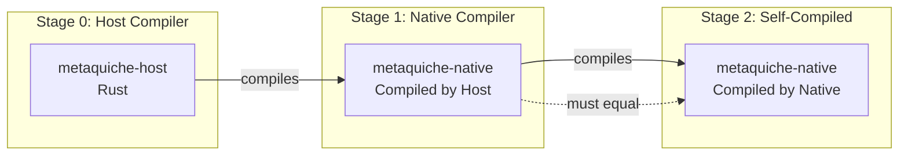
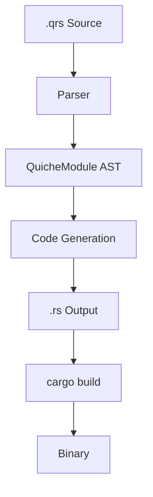
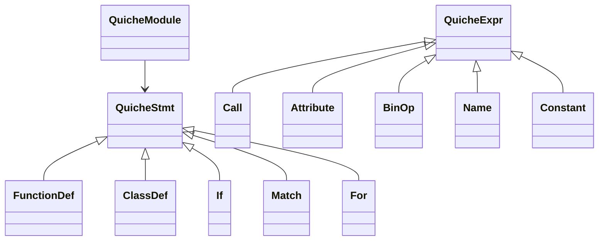

# Quiche Compiler Architecture

## Overview

Quiche uses a **multi-stage bootstrap** architecture where the compiler compiles itself.



**Verification**: Stage 1 and Stage 2 outputs must be identical to prove the compiler is self-consistent.

---

## Compiler Stages

| Stage | Compiler | Written In | Compiles |
|-------|----------|------------|----------|
| 0 | [metaquiche-host](file:///Volumes/Dev/code/jagtesh/quiche/crates/metaquiche-host/src/lib.rs) | Rust | Quiche → Rust |
| 1 | metaquiche-native (via Stage 0) | Quiche | Quiche → Rust |
| 2 | metaquiche-native (via Stage 1) | Quiche | Quiche → Rust |

---

## Compilation Pipeline

Both compilers follow the same pipeline:



### Parser

Uses [quiche-parser](file:///Volumes/Dev/code/jagtesh/quiche/crates/quiche-parser/src/lib.rs) which wraps `ruff_python_parser` and converts to Quiche AST.

### Code Generation

The core of both compilers. Traverses AST and emits Rust code.

---

## Host Compiler (metaquiche-host)

Written in Rust. Entry point: [lib.rs](file:///Volumes/Dev/code/jagtesh/quiche/crates/metaquiche-host/src/lib.rs)

### Module Structure

| Module | Purpose |
|--------|---------|
| [lib.rs](file:///Volumes/Dev/code/jagtesh/quiche/crates/metaquiche-host/src/lib.rs) | `Codegen` struct, symbol table, main API |
| [stmt.rs](file:///Volumes/Dev/code/jagtesh/quiche/crates/metaquiche-host/src/stmt.rs) | Statement emission (if, for, class, match) |
| [expr.rs](file:///Volumes/Dev/code/jagtesh/quiche/crates/metaquiche-host/src/expr.rs) | Expression emission (calls, binops, literals) |
| [types.rs](file:///Volumes/Dev/code/jagtesh/quiche/crates/metaquiche-host/src/types.rs) | Type conversion (Quiche types → Rust types) |

### Key Methods

```
Codegen::generate()        → Main entry, processes module
Codegen::generate_stmt()   → Dispatches by statement type
Codegen::generate_expr()   → Dispatches by expression type
Codegen::type_to_string()  → Converts type annotations
```

---

## Native Compiler (metaquiche-native)

Written in Quiche. Entry point: [main.qrs](file:///Volumes/Dev/code/jagtesh/quiche/crates/metaquiche-native/src/main.qrs)

### Module Structure

| Module | Purpose |
|--------|---------|
| [main.qrs](file:///Volumes/Dev/code/jagtesh/quiche/crates/metaquiche-native/src/main.qrs) | CLI, file handling, module discovery |
| [codegen.qrs](file:///Volumes/Dev/code/jagtesh/quiche/crates/metaquiche-native/src/compiler/codegen.qrs) | All code generation logic |
| [type_utils.qrs](file:///Volumes/Dev/code/jagtesh/quiche/crates/metaquiche-native/src/compiler/type_utils.qrs) | Type inference utilities |

### Key Methods

```
Codegen.generate()           → Main entry
Codegen.generate_stmt()      → Statement dispatch
Codegen.generate_expr()      → Expression dispatch
Codegen.emit_function_def()  → Function emission
Codegen.emit_class_def()     → Struct/enum emission
Codegen.type_to_string()     → Type conversion
```

---

## AST Structure

Defined in [quiche-parser/src/ast.rs](file:///Volumes/Dev/code/jagtesh/quiche/crates/quiche-parser/src/ast.rs).



---

## Runtime Support

[quiche-runtime](file:///Volumes/Dev/code/jagtesh/quiche/crates/quiche-runtime/src/lib.rs) provides macros used by generated code:

| Macro | Purpose |
|-------|---------|
| `check!` | Wraps fallible operations, converts errors |
| `qref!` | Immutable borrow (`&x`) |
| `mutref!` | Mutable borrow (`&mut x`) |
| `deref!` | Dereference (`*x`) |

---

## Build System

See [Makefile](file:///Volumes/Dev/code/jagtesh/quiche/Makefile) for targets:

```bash
make stage1   # Host compiles Native
make stage2   # Native compiles Native  
make verify   # Compare Stage 1 = Stage 2
make test     # Run test suite
```
