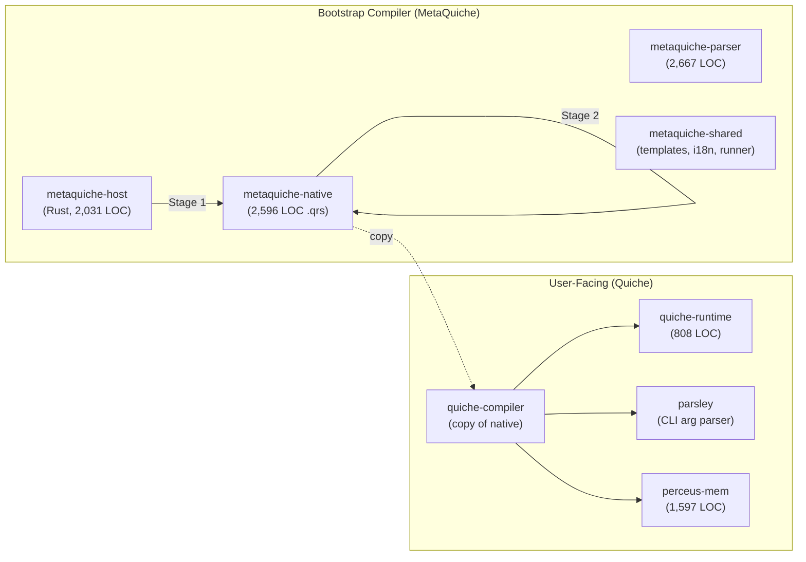

# Project Status — February 2026

> **State:** Self-hosted compiler is stable and producing working binaries. The Quiche (`.q`) dialect supports core Pythonic features. Memory management library (`perceus-mem`) is implemented. Threading and async support are proposed but not yet built.

---

## Architecture At a Glance

```
8 workspace crates  ·  ~7,300 lines compiler core  ·  15 third-party deps  ·  0 unsafe blocks
```



---

## Milestone Tracker

| # | Phase | Status | Evidence |
|---|-------|--------|----------|
| 1 | **Bootstrap** — Host compiler (Rust) compiles native compiler | ✅ Done | `make stage0 && make stage1` |
| 2 | **Self-hosting** — Native compiler compiles itself | ✅ Done | `make stage2`, verified parity via `make verify` |
| 3 | **Minimal dependencies** — Only essential crates | ✅ Done | 15 total deps (was 100+; removed Ruff, rust-i18n, etc.) |
| 4 | **Custom parser** — Hand-written lexer + recursive-descent parser | ✅ Done | `metaquiche-parser`, zero external parser deps |
| 5 | **Template system** — Shared codegen strings for stage parity | ✅ Done | `metaquiche-shared/templates/*.toml` |
| 6 | **i18n** — All user-facing strings via template-based `t!()` macro | ✅ Done | Replaced `rust-i18n` (54 transitive deps) |
| 7 | **Memory management** — Perceus-style library | ✅ Done | `perceus-mem`: FBIP, regions, weak refs, Store + Managed |
| 8 | **Quiche dialect** — Higher-level `.q` files with auto-borrowing | 🔄 Active | Comprehensions, f-strings, lambdas, structs working |
| 9 | **Diagnostics** — Error reporting, telemetry, `UnwrapOrExit` | 🔄 Active | Colorized pipeline, source-located error context |
| 10 | **Testing framework** — qtest runner + assert-based testing | 🔄 Active | `make test` runs 4 smoke tests; 31 test files exist |
| 11 | **Rust interop** — `@extern` bindings + `rust.*` bridge | 📋 Designed | `docs/language_design/07_rust_interop.md` |
| 12 | **Threading** — `@threadsafe`, Rayon, Tokio integration | 📋 Designed | `docs/threading_proposal.md` |
| 13 | **Quill TUI framework** — UI framework in pure Quiche | 📋 Planned | Phase 0 prerequisites identified |
| 14 | **async/await** | ❌ Not started | — |
| 15 | **PyO3 interop** | ❌ Not started | — |

---

## What Works Today

### MetaQuiche (`.qrs`)

Complete feature set — this is the language the compiler is written in:

- Functions with full type annotations and generics
- Structs, Enums (with tuple/unit variants), Traits, `@impl`
- Pattern matching with exhaustiveness checking
- `ref(x)`, `mutref(x)`, `deref(x)` for explicit borrowing
- `range()`, slices (`[1..3]`, `[2..]`, `[..5]`)
- Lambda expressions (`|x, y| x + y`)
- Module-level constants (`SCREAMING_CASE` or `Const[T]`)
- `@derive`, `@extern` decorators
- `Dyn[T]` trait objects (`Box[Dyn[Logger]]`, `Ref[Dyn[Display]]`)
- `HashMap`, `Vec`, `Option`, `Result` natively
- Full Rust import system via `from rust.* import`

### Quiche (`.q`)

Higher-level dialect in active development:

- **Auto-borrowing** — compiler inserts `ref()`/`mutref()` automatically
- **List comprehensions** — `[x * 2 for x in nums]`
- **Dict comprehensions** — `{k.name: k for k in items}`
- **F-strings** — `f"Hello {name}, age {age}"`
- **Multi-line f-strings** — triple-quoted f-strings
- **Structs with methods** — `class Student(Struct)` with `def new()`, `def bio()`
- **Lambdas** — `|x: i32, y: i32| x + y`
- **Pythonic `len()`** — maps to `.len()`
- **Pythonic `print()`** — maps to `println!()`
- **Type coercion** — implicit casting with `as`
- **Sudoku solver** working end-to-end (`examples/scripts/sudoku.q`)

### Memory Management (`perceus-mem`)

| Module | Lines | Feature |
|--------|-------|---------|
| `managed.rs` | 243 | FBIP copy-on-write with `Managed<T>` wrapper |
| `store.rs` | 327 | Generation-validated arena (`Store<T>`, `ThreadSafeStore<T>`) |
| `region.rs` | 279 | Arena allocation with `Region` and `RegionHandle` |
| `weak.rs` | 148 | Non-owning `Weak<T>` references for cycle prevention |
| `handle.rs` | 86 | Typed handles with generation validation |
| `policy.rs` | 150 | `SingleThreaded` + `ThreadSafe` policy abstraction |
| `inline.rs` | 217 | Stack-allocated types (`Color`, `Vec2`—`Vec4`) |
| `generation.rs` | 104 | Generation counter for use-after-free prevention |

### Runtime (`quiche-runtime`)

- `QuicheBorrow` trait — panic-free borrowing via `try_borrow_q()` / `try_borrow_mut_q()`
- `MemoryAnalyzer` — escape analysis for auto-borrowing decisions
- `QuicheRuntime` — introspection + module registry
- `qtest` — test framework (`TestResult`, `TestSummary`, check functions)
- Diagnostic emission — `emit_warning()`, `emit_error()`, `emit_note()`
- AST transformer — runtime AST modification for syntactic sugar
- Builtins — `len()`, `print()`, `range()`, regex via `re` module
- Pathlib — `quiche::Path` for filesystem operations

---

## Codebase Metrics

| Component | Lines | Files | Language |
|-----------|-------|-------|----------|
| `metaquiche-native` (compiler) | 2,596 | 3 `.qrs` | Quiche |
| `metaquiche-host` (bootstrap) | 2,031 | 4 `.rs` | Rust |
| `metaquiche-parser` | 2,667 | 2 `.rs` | Rust |
| `metaquiche-shared` | — | templates, runner, i18n | Rust |
| `perceus-mem` | 1,597 | 9 `.rs` | Rust |
| `quiche-runtime` | 808+ | 9 `.qrs` + `.rs` | Mixed |
| `parsley` | 64 | 1 `.rs` + `.qrs` build | Quiche |
| `quiche-compiler` | (copy of native) | — | Quiche |
| **Tests** | — | 31 files | `.q` / `.qrs` |
| **Examples** | — | 7 scripts | `.q` / `.qrs` |
| **Docs** | — | 20+ files | Markdown |

### Dependencies

```
Workspace total: 15 third-party crates
perceus-mem:      0 deps (fully standalone)
metaquiche-shared: 0 deps
metaquiche-parser: 3 deps
metaquiche-host:   4 deps
metaquiche-native: 5 deps
quiche-runtime:    4 deps
quiche-compiler:   6 deps
parsley:           1 dep
```

---

## Known Gaps & Open Issues

### Testing (Critical Gap)

`make test` currently runs only **4 of 31** test files:
- 1 bootstrap regression (`test_private_visibility.qrs`)
- 3 Quiche smoke tests (`test_codegen_scope_regression.q`, `test_comprehensions.q`, `test_fstring.q`)

The remaining 27 test files exist but are not wired into the Makefile. The `qtest_runner.qrs` was developed but has unresolved import issues.

### Stage Parity

As of 2026-01-31, remaining stage1/stage2 output differences: ~45 lines across 4 files (import grouping style, `Default::default()` vs literal init, minor spacing). These are cosmetic and don't affect correctness.

### Documentation Gaps

| Document | Issue |
|----------|-------|
| `examples/README.md` | Lists only `.qrs` scripts; doesn't mention `.q` files or `demo.q` |
| `docs/features.md` | Missing: comprehensions, f-strings, lambdas, auto-borrowing, perceus-mem |
| `docs/language_design/05_pythonic.md` | Stub — only 6 lines, no content |
| `docs/compiler_guidelines.md` | Parity stats dated 2026-01-31, likely outdated |
| `docs/testing/quiche.md` | References `try/except` as "coming soon" — still not implemented |
| `README.md` | Status table Phase 4 says "Memory mgmt" Done but doesn't mention perceus-mem specifics |

### Unimplemented Language Features

| Feature | Where Designed | Status |
|---------|---------------|--------|
| `try/except` | `docs/testing/quiche.md` | Not implemented |
| Default function arguments | `AGENTS.md` limitation | Not supported |
| Threading / `@threadsafe` | `docs/threading_proposal.md` | Proposal only |
| Async/await | `docs/features.md` roadmap | Not started |
| Pipe operators | Conversation `ed95c047` | Explored, not implemented |
| `@macro` metaprogramming | `docs/language_design/04_meta_quiche.md` | Designed, not implemented |
| Auto-casting `auto()` | `docs/language_design/99_ideas.md` | Idea only |
| Simplified lifetimes | `docs/why-quiche.md` | Vision, not implemented |

---

## Build Artifacts

All binaries are built and symlinked:

```
bin/
├── mq0      → target/debug/mq0          (Host compiler)
├── stage0   → target/debug/mq0          (alias)
├── mq1      → target/stage1/debug/mq    (Stage 1)
├── stage1   → target/stage1/debug/mq    (alias)
├── mq       → target/stage2/debug/mq    (Stage 2 — production bootstrap)
├── stage2   → target/stage2/debug/mq    (alias)
├── quiche   → target/quiche/debug/mq    (User-facing Quiche compiler)
└── mq-quiche → target/quiche/debug/mq   (alias)
```

Last built: **2026-02-06**
